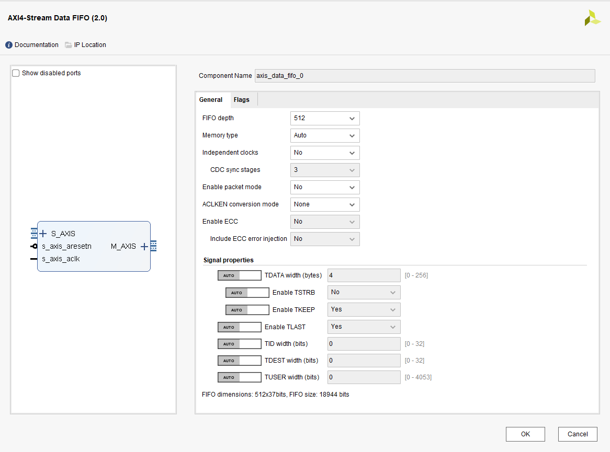

# AXIDMA在Linux中的使用

[TOC]

# 1. 概要

在linux环境下，DMA大多数情况是在驱动中使用，以释放CPU执行其他任务。

本文主要分享如何在Linux驱动中使用Xlinx-ZYNQ7035的AXI-DMA软核，完成DDR中的回环测试。

> [!note]
>
> 注意，受限于篇幅，这里的内核编译，交叉编译工具链配置等操作，默认读者已熟悉。


## **目标效果**

 	在PS端的linux驱动中，申请两片DDR内存缓冲区，配置DMA进行搬移测试，最后校验两片缓冲区中的数据是否一致，来判断DMA传输是否正常。

驱动中申请两片内存（虚拟内存），映射物理内存给DMA使用

- src_buf(虚拟内存)  ---> src_dma(物理内存)
- dst_buf(虚拟内存)  ---> dst_dma(物理内存)

DMA数据流转图简化，实际上AXI中包含PS的HP对接DMA，PS的DDR控制器去操作DDR，这里省略掉。


## **基本思路**

1. **硬件构建**，vivado配置AXI_DMA的IP核，生成bit和xsa。
2. **设备树和内核生成**，根据xsa获取设备树（pl.dtsi）
3. **驱动**，在驱动中使用AXI-DMA。
4. **驱动验证**


## **环境**

- 硬件环境

  - 米联客的ZYNQ-M7035FB

- 软件环境

  - Ubuntu 16.04.7 LTS （内核源码和交叉编译工具链）
    - Petalinux2022.2 

  - windows 10
    - Vivado 2022.2
  
    - Xilinx Vitis 2022.2
  
  
  

**各个节点的关键输出总览**

> [!note]
>
> - system.bit	// FPGA输出的固件，包含PL端的硬件
>- system.dtb      // 设备树
> - zImage             // 内核镜像，主要是使能了DMA相关的驱动
> - mydma.ko       // 使用DMA完成传输测试的驱动
> 
> 注：uboot和rootfs因为和本文内容不相关，就不特意做介绍


# 2. 硬件构建

- 这部分主要为了获取两个东西
  - system.bit	// fpga对应的输出固件
  - system.xsa      // fpga固件相对于的硬件描述文件用于生产设备树

## PL硬件构建

​	AXI-DMA是在PL端的一个IP核，功能和模式需要进行基础的配置，这里介绍一下整体的框图和配置流程。	

PS与PL之间通过AXI总线进行通信，其中配置AXI-DMA的寄存器因为数据量不大使用带宽相对小的GP接口，数据流则使用带宽较大的HP接口，框图如下。

> [!NOTE]
>
> 这里的AXI4-FIFO是个带AXI接口的FIFOIP，主要用来演示AXI-DMA通过MM2S/S2MM两个总线访问外部设备的情况。如果只做DMA的环路测试，实际可以不要这个FIFO。

​	

## **vivado框图**

​	AXI-DMA是一个IP核，最后生成一个硬件电路，里面包含了用于配置的寄存器，如源目的地址，传输方向、数据量大小、模式等，外部设备通过配置这些寄存器完成DMA的工作。

> [!note]
>
> 寄存器的配置工作在linux的驱动中完成，一般由芯片厂商编写好，xilinx AXI-DMA Driver源码： linux-xlnx/drivers/dma/xilinx/xilinx_dma.c。


## **AXI-DMA连接详情**

​	AXI-DMA的寄存器访问途径是S_AXI_LITE总线，与PS端的GP0接口相连，数据流走HP高速接口。

​	PS(CPU) ---- GP0 ---- S_AXI_LITE --- AXI-DMA --- REGS(寄存器)


## **AXI-DMA和FIFI配置**

基本即使默认配置，这里不使能S/G模式，使用简单的直传模式即可。

> [!Note] 
>
> AXI-DMA有三种模式可选
>
> - Direct Register：简单的DMA。
> - Scatter/Gather:  多个简单传输链接起来的，从头到尾执行一遍。
> - Cyclic DMA：就是在SG模式下传输完最后一项后又从头开始继续传输。


##**FIFO**

使用默认配置



vivado上的配置比较简单，基本上都是默认配置，使用自动连接把时钟和复位等信号连接号就可以了。

接下了就是综合生成bit和xsa(导出)，至此硬件部分完成。

**整体情况**

- [x] system.bit	// FPGA输出的固件，包含PL端的硬件
- [ ] system.dtb      // 设备树
  - [x] system.xsa // 中间产物
- [ ] zImage             // 内核镜像，主要是使能了DMA相关的驱动
- [ ] mydma.ko       // 使用DMA完成传输测试的驱动


# 3. 设备树和内核生成

这部分主要为了获取两个东西

- zImage		// linux内核镜像
- system.dtb      // 设备树编译文件

​	传统情况下在zynq的开发中，使用petalinux工具就可以完成boot\kernel\rootfs的编译和打包。但是受限于外网服务器环境，petalinux在编译过程中下载会很慢，而且体量较大，仅仅修改稿源码中的一点代码，编译都需要很长时间，所以这里并没有完全使用petalinux，而是做了分离，把kernel的编译分离出来，这样对后面的内核裁剪和驱动开发比较友好。

> [!NOTE]
>
> 参考：《启明星ZYNQ之嵌入式Linux开发指南_V3.2》的第二十章-搭建驱动开发使用的 ZYNQ 镜像
>
> 内核仓库： https://github.com/Xilinx/linux-xlnx
>
> 分支：xlnx_rebase_v5.15_LTS_2022.1_update

## **使用vitis生成设备树**

​	笔者使用petalinux生成设备树的过程中发现，PL最终影响的其实是pl.dtsi这个设备树文件。由于这个过程需要用petalinux编译，比较耗时（相对于直接make dtbs来说），所以这里如果有种方法能够从xsa中生成pl.dtis就好了，vitis就可以，我的理解是vitis是解析xsa中的信息，然后生成pl.dtsi。而petalinux应该也是解析了只是做了其他的编译动作所以要费时很多。

> **使用vitis生成设备树的主要步骤**
>
>  	1. 导入xilinx设备树源码包
>  	2. 根据xsa生成设备树

​	详情参考下面这篇博文：

https://blog.csdn.net/weixin_42963900/article/details/140327256?fromshare=blogdetail&sharetype=blogdetail&sharerId=140327256&sharerefer=PC&sharesource=mc_li&sharefrom=from_link

​	另外在写博文时，发现一个另外的方法，详见博文，只是dt_overlay我用的flase,也能达到生成pl.dtis的目的

https://blog.csdn.net/weixin_42963900/article/details/142446679?fromshare=blogdetail&sharetype=blogdetail&sharerId=142446679&sharerefer=PC&sharesource=mc_li&sharefrom=from_link


## **替换和编译设备树**

得到pl.dtsi后，将内容添加进内核源码中的arch/arm/boot/dts/pl.dtsi，然后执行编译设备树编译命令即可

最终的pl.dtsi如下，出了vitis生成的axi_dma_0节点外，还添加了axidmatest_0节点，因为后续驱动会用到所以这里一并添加了。

```c
/*
 * CAUTION: This file is automatically generated by Xilinx.
 * Version: XSCT 
 * Today is: Tue Sep  3 05:44:12 2024
 */
#include <dt-bindings/interrupt-controller/irq.h>

/ {
	amba_pl: amba_pl {
		#address-cells = <1>;
		#size-cells = <1>;
		compatible = "simple-bus";
		ranges ;
		axidmatest_0: axidmatest@0 {
                     compatible ="xlnx,axi-dma-test-1.00.a";
                     dmas = <&axi_dma_0 0
                             &axi_dma_0 1>;
                     dma-names = "axidma0", "axidma1";
                };
		axi_dma_0: dma@40400000 {
			#dma-cells = <1>;
			clock-names = "s_axi_lite_aclk", "m_axi_mm2s_aclk", "m_axi_s2mm_aclk";
			clocks = <&clkc 15>, <&clkc 15>, <&clkc 15>;
			compatible = "xlnx,axi-dma-7.1", "xlnx,axi-dma-1.00.a";
			interrupt-names = "mm2s_introut", "s2mm_introut";
			interrupt-parent = <&intc>;
			interrupts = <0 29 4 0 30 4>;
			reg = <0x40400000 0x10000>;
			xlnx,addrwidth = <0x20>;
			xlnx,sg-length-width = <0xe>;
			dma-channel@40400000 {
				compatible = "xlnx,axi-dma-mm2s-channel";
				dma-channels = <0x1>;
				interrupts = <0 29 4>;
				xlnx,datawidth = <0x20>;
				xlnx,device-id = <0x0>;
			};
			dma-channel@40400030 {
				compatible = "xlnx,axi-dma-s2mm-channel";
				dma-channels = <0x1>;
				interrupts = <0 30 4>;
				xlnx,datawidth = <0x20>;
				xlnx,device-id = <0x0>;
			};
		};
	};
};
```


## **linux内核编译**

为了使用axi-dma需要确认内核的一些配置，如DMAEngine等

```C
 > Device Drivers > DMA Engine support
	<*>   Xilinx AXI DMAS Engine
    <*>   DMA Test client 
 
make ARCH=arm CROSS_COMPILE=arm-linux-gnueabihf- -j4	// 编译内核 --> arch/arm/boot/zImage
```


## **单独编译设备树**

进入到linux源码的根目录，执行编译命令即可

```she
make ARCH=arm CROSS_COMPILE=arm-linux-gnueabihf- dtbs // 编译设备树 --> arch/arm/boot/dts/system-top.dtb
```


**整体情况**

- [x] system.bit	// FPGA输出的固件，包含PL端的硬件
- [x] system.dtb      // 设备树
  - [x] system.xsa // 中间产物
- [x] zImage             // 内核镜像，主要是使能了DMA相关的驱动
- [ ] mydma.ko       // 使用DMA完成传输测试的驱动


# 4. 驱动部分

​	这里是站在linux内核的DMA框架上对AXI-DMA进行使用的驱动，也就是dma_client，而AXI-DMA的硬件相关操作的驱动已经由xilinx官方写好了，并且对接了linux的DMA框架。

​	我们要写的驱动参考xilinx的axidmatest.c，这部分没有太多可说的基本是按照linux的DMA框架申请使用DMA即可，详情见源码。

> 层次关系为：xilinx AXI-DMA Driver ---> Linux DMA框架 --> 我们要写的驱动
>
> xilinx AXI-DMA Driver源码：
>
> - linux-xlnx/drivers/dma/xilinx/xilinx_dma.c
> - linux-xlnx/drivers/dma/xilinx/axidmatest.c

基本流程

1.  申请DMA通道
2. 申请内存
3. 准备DMA的描述符，也就是要传输的数据信息，已经传输完成后的回调函数
4. 启动DMA

**驱动源码 my_axidma.c**

``` c
#include <linux/module.h>
#include <linux/platform_device.h>
#include <linux/dmaengine.h>
#include <linux/interrupt.h>
#include <linux/io.h>
#include <linux/kernel.h>
#include <linux/init.h>
#include <linux/dma-mapping.h>
#include <linux/of.h>
#include <linux/of_address.h>
#include <linux/of_gpio.h>
#include <linux/of_irq.h>
#include <linux/ktime.h>
#include <linux/math64.h>

#define TEST_BUFFER_SIZE (1*1024)
#define TEST_DMA_ALIGNMENT 4
struct my_dma_test {
    struct dma_chan *tx_chan;       // DMA 通道
    struct dma_chan *rx_chan;       // DMA 通道
    uint8_t *src_buf;               // 源缓冲区
    uint8_t *dst_buf;               // 目标缓冲区
    dma_addr_t src_dma;             // 源DMA地址
    dma_addr_t dst_dma;             // 目标DMA地址
    struct platform_device *pdev; // 平台设备指针
    struct completion dma_rx_complete, dma_tx_complete;  // 用于等待 DMA 完成的完成信号量
    dma_cookie_t rx_cookie, tx_cookie;  // DMA cookie
    int irq_tx, irq_rx;             // DMA 中断号
    ktime_t	start, diff;
};

// 向后对齐
static void *addr_alignment(void *addr, unsigned int alignment)
{
    return (void *)(((uintptr_t)addr + alignment - 1) & ~(alignment - 1));
}

static void dma_rx_callback(void *param)
{
    struct my_dma_test *dma_test = (struct my_dma_test *)param;
    int i, ret, size, use_ms;
    double speed;

    pr_info("DMA transfer RX completed start data verification...\n");
    dma_test->diff = ktime_sub(ktime_get(), dma_test->start);

    for(i=0; i<TEST_BUFFER_SIZE; i++)
    {
        //pr_info("%02X ", dma_test->dst_buf[i]);
        if(dma_test->dst_buf[i] != dma_test->src_buf[i])
        {
            pr_err("Data verification failed! dst_buf[%03d]:%d --- src_buf[%03d]:%d\n", 
                i, dma_test->dst_buf[i], i, dma_test->src_buf[i]);
            complete(&dma_test->dma_rx_complete);
            return;
        }
    }

    pr_info("Data verification pass time:%d ns\n", ktime_to_ns(dma_test->diff));
    complete(&dma_test->dma_rx_complete);
}

static void dma_tx_callback(void *param)
{
    struct my_dma_test *data = (struct my_dma_test *)param;
    pr_info("DMA transfer TX completed\n");
    complete(&data->dma_tx_complete);
}

static int axi_dma_test_probe(struct platform_device *pdev)
{
    struct my_dma_test *dma_test;
    struct dma_async_tx_descriptor *tx_desc;
    struct dma_async_tx_descriptor *txd = NULL;
	struct dma_async_tx_descriptor *rxd = NULL;
    uint8_t *aligned_src_buf, *aligned_dst_buf;
    struct scatterlist tx_sg;
	struct scatterlist rx_sg;
    int ret, status;
    enum dma_ctrl_flags flags;
    unsigned long tx_tmo = msecs_to_jiffies(30000);
    unsigned long rx_tmo = msecs_to_jiffies(30000);
    int i;
    

    // 分配驱动结构体
    dma_test = devm_kzalloc(&pdev->dev, sizeof(struct my_dma_test), GFP_KERNEL);
    if (!dma_test)
        return -ENOMEM;

    dma_test->pdev = pdev;
    platform_set_drvdata(pdev, dma_test);

    /* 1. 申请DMA通道 
        axidmatest_0: axidmatest@0 {
                compatible ="xlnx,axi-dma-test-1.00.a";
                dmas = <&axi_dma_0 0
                        &axi_dma_0 1>;
                dma-names = "axidma0", "axidma1";
        };
    */
    dma_test->tx_chan = dma_request_chan(&pdev->dev, "axidma0");  // TX
    if (!dma_test->tx_chan) {
        pr_err("Failed to request DMA TX channel\n");
        ret = -ENODEV;
        goto err_devfree;
    }

    dma_test->rx_chan = dma_request_chan(&pdev->dev, "axidma1");  // RX
    if (!dma_test->rx_chan) {
        pr_err("Failed to request DMA RX channel\n");
        dma_release_channel(dma_test->tx_chan);
        ret = -ENODEV;
        goto err_devfree;
    }

    /* 2. 分配DMA内存
        这里分配了一个虚拟地址供CPU操作，另外映射了一个DMA地址供DMA操作(DMA需要使用物理地址)
        dma_test->src_buf： 虚拟地址
        dma_test->src_dma： 物理地址
    */
    // 小于4M的内存可以直接使用dma_alloc_coherent分配
    dma_test->src_buf = dma_alloc_coherent(&pdev->dev, TEST_BUFFER_SIZE, &dma_test->src_dma, GFP_KERNEL);
    dma_test->dst_buf = dma_alloc_coherent(&pdev->dev, TEST_BUFFER_SIZE, &dma_test->dst_dma, GFP_KERNEL);
    if(!dma_test->src_buf || !dma_test->dst_buf) {
        pr_err("Failed to allocate DMA memory\n");
        ret = -ENOMEM;
        goto err_devfree;
    }

    /* 3.  准备数据， 把数据源填充成特定值，用于后面校验对比。清空目的地缓存 */
    for(i=0; i<TEST_BUFFER_SIZE; i++)
    {
        dma_test->src_buf[i] = i;
        dma_test->dst_buf[i] = 0;
    }

    pr_info("#####src_buf: 0x%x, dma_test->src_dma: 0x%x\n", dma_test->src_buf, dma_test->src_dma);
    pr_info("#####dst_buf: 0x%x, dma_test->dst_dma: 0x%x\n", dma_test->dst_buf, dma_test->dst_dma);

    /* 4. 准备DMA需要的描述符， 告知DMA数据传输的源目的地址、数据量大小等 
        注意：这里使用的API是sg模式的，即scatter-gather模式，可以传输多个不连续的数据块
            但实际上PL段的IP核是配置成了simple模式，即只能传输一个连续的数据块
            所以这里把SG的数量设置成了1，也就是让DMA传输一个连续的数据块
        为什么？
            因为直接使用DAM传输会有问题，原因还不知道，这里可以通过SG模式来传输，有点曲线救国的意思了
            
    */
    sg_init_table(&tx_sg, 1);
	sg_init_table(&rx_sg, 1);
    pr_info("sg_init_table pass\n");

    sg_dma_address(&tx_sg) = dma_test->src_dma;
    sg_dma_address(&rx_sg) = dma_test->dst_dma;
    pr_info("sg_dma_address pass\n");

    sg_dma_len(&tx_sg) = TEST_BUFFER_SIZE;
    sg_dma_len(&rx_sg) = TEST_BUFFER_SIZE;
    pr_info("sg_dma_len pass\n");

    flags = DMA_CTRL_ACK | DMA_PREP_INTERRUPT;
    rxd = dma_test->rx_chan->device->device_prep_slave_sg(dma_test->rx_chan, &rx_sg, 1, DMA_DEV_TO_MEM, flags, NULL);
    pr_info("device_prep_slave_sg rx pass\n");

    txd = dma_test->tx_chan->device->device_prep_slave_sg(dma_test->tx_chan, &tx_sg, 1, DMA_MEM_TO_DEV, flags, NULL);
    pr_info("device_prep_slave_sg tx pass\n");
    if (!rxd || !txd) {
        pr_err("Failed to prepare DMA memcpy\n");
        ret = -ENOMEM;
        goto err_free_buffers;
    }

    init_completion(&dma_test->dma_rx_complete);
    rxd->callback = dma_rx_callback;
    rxd->callback_param = dma_test;
    dma_test->rx_cookie = rxd->tx_submit(rxd);

    init_completion(&dma_test->dma_tx_complete);
    txd->callback = dma_tx_callback;
    txd->callback_param = dma_test;
    dma_test->tx_cookie = txd->tx_submit(txd);

    if (dma_submit_error(dma_test->rx_cookie) ||
        dma_submit_error(dma_test->tx_cookie)) {
        pr_err("Failed to submit DMA transfer\n");
        ret = -ENOMEM;
        goto err_free_buffers;
    }

    /* 5. 启动DMA传输
        这里只是通知了DMA有个传输任务来了，但是实际上并不一定里面就会被执行，只是加入了DMA的任务队列中
        实际传输完成了，会调用dma_rx_callback和dma_tx_callback通知
        当然也可以在这里轮询等待DMA传输完成，但是这样会占用CPU资源，不推荐
    */
    dma_async_issue_pending(dma_test->rx_chan);
    dma_async_issue_pending(dma_test->tx_chan);
    dma_test->start = ktime_get();

    pr_info("DMA transfer start!\n");

    #if 0
    tx_tmo = wait_for_completion_timeout(&dma_test->dma_tx_complete, tx_tmo);

    status = dma_async_is_tx_complete(dma_test->tx_chan, dma_test->tx_cookie,
                        NULL, NULL);

    if (tx_tmo == 0) {
        pr_err("TX test timed out\n");
        ret = -ENOMEM;
        goto err_free_buffers;
    } else if (status != DMA_COMPLETE) {
        pr_err("TX test succ\n");
    }

    rx_tmo = wait_for_completion_timeout(&dma_test->dma_rx_complete, rx_tmo);

    status = dma_async_is_tx_complete(dma_test->rx_chan, dma_test->rx_cookie,
                        NULL, NULL);

    if (rx_tmo == 0) {
        pr_err("RX test timed out\n");
        ret = -ENOMEM;
        goto err_free_buffers;
    } else if (status != DMA_COMPLETE) {
        pr_err("RX test succ\n");
    }

    for(i=0; i<TEST_BUFFER_SIZE; i++)
    {
        //pr_info("%02X ", dma_test->dst_buf[i]);
        if(dma_test->dst_buf[i] != dma_test->src_buf[i])
        {
            pr_err("Data verification failed! dst_buf[%03d]:%d --- src_buf[%03d]:%d\n", 
                dma_test->dst_buf[i], i, dma_test->src_buf[i], i);
            ret = -ENOMEM;
            goto err_free_buffers;
        }
    }
    pr_info("Data verification pass\n");
    pr_info("DMA transfer completed successfully\n");
    #endif

    return 0;

err_free_buffers:
    dma_free_coherent(&pdev->dev, TEST_BUFFER_SIZE, dma_test->src_buf, dma_test->src_dma);
    dma_free_coherent(&pdev->dev, TEST_BUFFER_SIZE, dma_test->dst_buf, dma_test->dst_dma);

err_devfree:
    devm_kfree(&pdev->dev, dma_test);
    return ret;
}

static int axi_dma_test_remove(struct platform_device *pdev)
{
    struct my_dma_test *dma_test = platform_get_drvdata(pdev);

    dma_free_coherent(&pdev->dev, TEST_BUFFER_SIZE, dma_test->src_buf, dma_test->src_dma);
    dma_free_coherent(&pdev->dev, TEST_BUFFER_SIZE, dma_test->dst_buf, dma_test->dst_dma);

    if(dma_test->tx_chan)
        dma_release_channel(dma_test->tx_chan);
    if(dma_test->rx_chan)
        dma_release_channel(dma_test->rx_chan);

    devm_kfree(&pdev->dev, dma_test);

    return 0;
}

static const struct of_device_id axi_dma_test_of_match[] = {
    { .compatible = "xlnx,axi-dma-test-1.00.a", },
    {},
};
MODULE_DEVICE_TABLE(of, axi_dma_test_of_match);

static struct platform_driver axi_dma_test_driver = {
    .driver = {
        .name = "axi_dma_test",
        .of_match_table = axi_dma_test_of_match,
    },
    .probe = axi_dma_test_probe,
    .remove = axi_dma_test_remove,
};

module_platform_driver(axi_dma_test_driver);

MODULE_LICENSE("GPL");
MODULE_AUTHOR("Your Name");
MODULE_DESCRIPTION("AXI DMA Test Driver");

```

Makefile

```makefile
# SPDX-License-Identifier: GPL-2.0
KERN_DIR = /home/workspace/exDisk/linux-xlnx	# 修改成你的内核源码目录

all:
	make ARCH=arm CROSS_COMPILE=arm-linux-gnueabihf- -C $(KERN_DIR) M=`pwd` modules 

clean:
	make ARCH=arm CROSS_COMPILE=arm-linux-gnueabihf- -C $(KERN_DIR) M=`pwd` modules clean
	rm -rf modules.order
	rm .*.cmd *.mod.*
	rm Module.symvers modules.order

my_dma-objs := my_axidma.o

obj-m += my_dma.o

```


**注意**

​	这里有个注意事项，在PL端配置的简单DMA模式，笔者在尝试使用简单DMA的操作流程时出错了，原因不明，后来参考axidmatest.c使用SG模式，并且把SG模式修改成了1块数据块，就可以正常传输了。

```C
// 直接DMA的操作，在dmaengine_prep_dma_memcpy处出错, 弃用
static int axi_dma_test_probe(struct platform_device *pdev)
{
    struct my_dma_test *dma_test;
    struct dma_async_tx_descriptor *tx_desc;
    uint8_t *aligned_src_buf, *aligned_dst_buf;
    int ret, status, flags;
    

    // 分配驱动结构体
    dma_test = devm_kzalloc(&pdev->dev, sizeof(struct my_dma_test), GFP_KERNEL);
    if (!dma_test)
        return -ENOMEM;

    dma_test->pdev = pdev;
    platform_set_drvdata(pdev, dma_test);
    // 初始化完成信号量
    init_completion(&dma_test->dma_complete);

    /* 1. 申请DMA通道 */
    dma_test->tx_chan = dma_request_chan(&pdev->dev, "axidma0");  // TX
    if (!dma_test->tx_chan) {
        pr_err("Failed to request DMA TX channel\n");
        ret = -ENODEV;
        goto err_devfree;
    }

    dma_test->rx_chan = dma_request_chan(&pdev->dev, "axidma1");  // RX
    if (!dma_test->rx_chan) {
        pr_err("Failed to request DMA RX channel\n");
        dma_release_channel(dma_test->tx_chan);
        ret = -ENODEV;
        goto err_devfree;
    }

    /* 2. 申请缓存并做DMA物理地址映射 */
    // 这里要做字节对齐，所以需要多申请一部分空间
    dma_test->src_buf = kmalloc(TEST_BUFFER_SIZE + TEST_DMA_ALIGNMENT - 1, GFP_KERNEL); 
    dma_test->dst_buf = kmalloc(TEST_BUFFER_SIZE + TEST_DMA_ALIGNMENT - 1, GFP_KERNEL);
    aligned_src_buf = addr_alignment(dma_test->src_buf, TEST_DMA_ALIGNMENT);
    aligned_dst_buf = addr_alignment(dma_test->dst_buf, TEST_DMA_ALIGNMENT);
    pr_info("#####src_buf: 0x%x, aligned_src_buf: 0x%x\n", dma_test->src_buf, aligned_src_buf);
    pr_info("#####dst_buf: 0x%x, aligned_src_buf: 0x%x\n", dma_test->dst_buf, aligned_dst_buf);

    // 它的作用是将一个内存缓冲区映射到设备可访问的地址空间，
    // 并返回一个可以被 DMA 引擎使用的物理地址（dma_addr_t）。
    // 这个函数通常用于单个缓冲区的映射
    // 虚拟内存src_buf/dst_buf通过dma_map_single映射到DMA可访问的物理内存dma_src/dma_dst
    // src_buf/dst_buf需要按4字节对齐(xilinx DMA硬件要求)
    dma_test->src_dma = dma_map_single(&pdev->dev, aligned_src_buf, TEST_BUFFER_SIZE, DMA_BIDIRECTIONAL);
    dma_test->dst_dma = dma_map_single(&pdev->dev, aligned_dst_buf, TEST_BUFFER_SIZE, DMA_BIDIRECTIONAL);
    if (dma_mapping_error(&pdev->dev, dma_test->src_dma) || dma_mapping_error(&pdev->dev, dma_test->dst_dma)) {
        pr_err("Failed to map DMA memory\n");
        ret = -ENOMEM;
        goto err_free_buffers;
    }
    /* 3. 注册传输完成的中断/回调 */
    /* 4. 设置DMA的传输信息，源目地地址、大小、长度等 */
    pr_info("src_dma: 0x%x, dst_dma: 0x%x\n", dma_test->src_dma, dma_test->dst_dma);

    if (IS_ERR_OR_NULL(dma_test->rx_chan)) {
		pr_err("IS_ERR_OR_NULL Invalid DMA memcpy channel\n");
		ret = -EINVAL;
	}
    
    flags = DMA_CTRL_ACK | DMA_PREP_INTERRUPT;
    tx_desc = dmaengine_prep_dma_memcpy(dma_test->tx_chan, dma_test->dst_dma, dma_test->src_dma, TEST_BUFFER_SIZE, flags);
    if(!tx_desc) {
        pr_err("Failed to prepare DMA memcpy\n");
        ret = -ENOMEM;
        goto err_dma_umap;
    }

    tx_desc->callback = dma_test_callback;
    tx_desc->callback_param = dma_test;

    /* 5. 启动DMA传输 */
    // 提交 DMA 传输
    pr_info("Submit DMA transfer...\n");
    dmaengine_submit(tx_desc);
    pr_info("Submit DMA transfer 1111\n");
    dma_async_issue_pending(dma_test->tx_chan);
    pr_info("Submit DMA transfer 222\n");

    // 等待 DMA 完成
    wait_for_completion_timeout(&dma_test->dma_complete, msecs_to_jiffies(5000));
    pr_info("Submit DMA transfer 333\n");

    // 检查 DMA 状态
    status = dma_async_is_tx_complete(dma_test->tx_chan, tx_desc->cookie, NULL, NULL);
    if (status != DMA_COMPLETE) {
        pr_err("DMA transfer failed\n");
        ret = -EIO;
        goto err_dma_umap;
    }

    pr_info("DMA transfer completed successfully\n");
    return 0;

err_dma_umap:
    dma_unmap_single(&pdev->dev, dma_test->src_dma, TEST_BUFFER_SIZE, DMA_MEM_TO_DEV);
    dma_unmap_single(&pdev->dev, dma_test->dst_dma, TEST_BUFFER_SIZE, DMA_BIDIRECTIONAL);

err_free_buffers:
    if(dma_test->src_buf)
        kfree(dma_test->src_buf);
    if(dma_test->dst_buf)
        kfree(dma_test->dst_buf);

err_devfree:
    devm_kfree(&pdev->dev, dma_test);
    return ret;
}
```

编译输出后得到my_dma.ko

**整体情况**

- [x] system.bit	// FPGA输出的固件，包含PL端的硬件
- [x] system.dtb      // 设备树
  - [x] system.xsa // 中间产物
- [x] zImage             // 内核镜像，主要是使能了DMA相关的驱动
- [x] mydma.ko       // 使用DMA完成传输测试的驱动


# 5. 驱动验证

加载驱动模块即可

``` shell
insmod my_dma.ko
```


**整体情况**

- [x] system.bit	// FPGA输出的固件，包含PL端的硬件
- [x] system.dtb      // 设备树
  - [x] system.xsa // 中间产物
- [x] zImage             // 内核镜像，主要是使能了DMA相关的驱动
- [x] mydma.ko       // 使用DMA完成传输测试的驱动
- [x] 验证OK

回头看整体流程其实还是跟传统的SOC适配一样，只是硬件变动发生在SOC内部。至此AXI-DMA在Linux中使用起来，祝大家玩的愉快。

> [!Note]
>
> 硬件 ----改变----> 设备树 ---选择使用--> linux驱动
>
> AXI-DMA --> pl.dtsi --> axidma Driver


老规矩资料放最后，感谢读完本篇的你！


**代码资料**

- https://github.com/mcli244/my_axidma.git


**参考**

- 《启明星ZYNQ之嵌入式Linux开发指南_V3.2.pdf》

- https://blog.csdn.net/weixin_42963900/article/details/140327256?fromshare=blogdetail&sharetype=blogdetail&sharerId=140327256&sharerefer=PC&sharesource=mc_li&sharefrom=from_link

- https://blog.csdn.net/weixin_42963900/article/details/142446679?fromshare=blogdetail&sharetype=blogdetail&sharerId=142446679&sharerefer=PC&sharesource=mc_li&sharefrom=from_link


